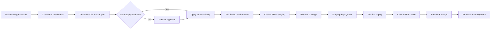

# Jamf Pro Terraform Starter

A comprehensive, production-ready Terraform configuration for managing a complete Jamf Pro instance with an opinionated configuration. This project demonstrates what the authors consider best practice for Infrastructure as Code (IaC) with Jamf Pro. It can serve as a foundation for your own deployment.

## 🎯 Overview

This starter project provides a fully-functional Jamf Pro configuration using Terraform, covering:

- **Core Settings**: Categories, enrollment, inventory collection, LAPS, ADE & VPP token support and more
- **Computer Management**: PreStages, smart groups, configuration profiles, policies, and packages
- **Mobile Device Management**: PreStages, smart groups, configuration profiles, and apps
- **Security & Compliance**: CIS benchmarks and Jamf Pro Blueprints
- **App Distribution**: App Installers and Mobile Device Apps (VPP)

## 📋 Prerequisites

### Required Tools

- [Terraform](https://www.terraform.io/downloads)
- Access to a Jamf Pro instance (cloud or on-premise)
- API credentials:
  - Jamf Pro
  - Jamf Platform (optional)

### Required Providers

- [`Jamf-Concepts/jamfplatform`](https://registry.terraform.io/providers/Jamf-Concepts/jamfplatform/latest) >= 0.2.0
- [`deploymenttheory/jamfpro`](https://registry.terraform.io/providers/deploymenttheory/jamfpro/latest) = 0.27.0

### API Credentials

You'll need:

1. **Jamf Pro OAuth2 Credentials** (Client ID & Secret)
   - Navigate to: Settings → System → API Roles and Clients
   - Create a new API Role with appropriate permissions
      - Review the modules in this project and the resources they declare. Create, Read Update and Delete permissions are required for each type
   - Create a new API client using the new Role

2. **Jamf Platform API Credentials** (Optional - for Blueprints and Compliance Benchmarks)
   - Follow the [Getting Started guide](https://developer.jamf.com/platform-api/reference/getting-started-with-platform-api)
   - **Note**: If you don't need Blueprints or Compliance Benchmarks, you can skip Jamf Platform configuration entirely. However, since Terraform providers initialize during `terraform init`, you must either:
     - Provide valid Jamf Platform credentials (even if unused), OR
     - Comment out or remove the `jamfplatform` provider block in the root `provider.tf` and the `blueprints` and `compliance_benchmarks` modules in root `main.tf`

## 🚀 Quick Start

### 1. Clone the Repository

**Option A: GitHub Desktop** (Suggested for Git beginners)

1. Download and install [GitHub Desktop](https://desktop.github.com/)
2. Click **File → Clone Repository**
3. Enter the repository URL
4. Choose a local path and click **Clone**

GitHub Desktop provides a user-friendly interface for managing branches, commits, and pull requests without command-line knowledge.

**Option B: Command Line**

```bash
git clone <repository-url>
cd terraform-jamfpro-starter
```

### 2. Install Terraform

**Suggested: Homebrew** (macOS)

If you don't already have Homebrew installed, install it first:

```bash
/bin/bash -c "$(curl -fsSL https://raw.githubusercontent.com/Homebrew/install/HEAD/install.sh)"
```

Then install Terraform:

```bash
brew tap hashicorp/tap
brew install hashicorp/tap/terraform
```

Verify the installation:

```bash
terraform --version
```

**Alternative Methods**:

- **Windows**: Download from [terraform.io](https://www.terraform.io/downloads) or use [Chocolatey](https://chocolatey.org/): `choco install terraform`
- **Manual Install**: Download the binary from [terraform.io](https://www.terraform.io/downloads) and add to your PATH

### 3. Set Up Your IDE

**Suggested: Visual Studio Code**

1. Download and install [Visual Studio Code](https://code.visualstudio.com/)
2. Install the **HashiCorp Terraform** extension:
   - Open VS Code
   - Go to Extensions (⌘+Shift+X on macOS, Ctrl+Shift+X on Windows/Linux)
   - Search for "HashiCorp Terraform"
   - Click **Install**

3. Enable **Format on Save** for Terraform files:
   - Follow [this guide](https://medium.com/nerd-for-tech/how-to-auto-format-hcl-terraform-code-in-visual-studio-code-6fa0e7afbb5e)

Setting up the Terraform extension offers the following nice features:

- Code is automatically formatted on save according to Terraform standards
- Easy-to-read color coding for language constructs
- Auto-completion for resource types, arguments, and functions
- Real-time syntax validation and error highlighting
- View resource/argument descriptions without leaving the editor
  - Navigate to module and variable definitions with ⌘+Click (Ctrl+Click)

### 4. Configure Authentication

Create a `terraform.tfvars` file in the root directory of the project:

```hcl
# Jamf Pro Configuration
jamfpro_instance_fqdn = "https://yourinstance.jamfcloud.com"
jamfpro_client_id     = "your-jamfpro-client-id"
jamfpro_client_secret = "your-jamfpro-client-secret"

# Jamf Platform Configuration (Optional - for Blueprints and Compliance Benchmarks)
jamfplatform_base_url      = "https://yourregion.apigw.jamf.com"
jamfplatform_client_id     = "your-jamfplatform-client-id"
jamfplatform_client_secret = "your-jamfplatform-client-secret"

```

**⚠️ Security Note**: Never commit `terraform.tfvars` to version control! It's already in `.gitignore`.

### 5. Initialize Terraform

```bash
terraform init
```

### 6. Review the Plan

```bash
terraform plan
```

### 7. Apply the Configuration

```bash
terraform apply -parallelism=1
```

## 📁 Project Structure

```
terraform-jamfpro-starter/
├── main.tf                          # Root module orchestration
├── provider.tf                      # Provider configurations
├── variables.tf                     # Input variables
├── locals.tf                        # Local values
├── terraform.tfvars                 # Variable values (gitignored)
│
└── modules/                         # Modular organization
    ├── settings/                    # Core Jamf Pro settings
    │   ├── categories.tf
    │   ├── automated-device-enrollment.tf
    │   ├── volume-purchasing-locations.tf
    │   ├── computer-checkin.tf
    │   ├── computer-inventory-collection.tf
    │   ├── local-admin-password-solution.tf
    │   ├── user-initiated-enrollment.tf
    │   └── ...
    │
    ├── computer-prestages/          # Computer PreStage enrollments
    ├── computer-smart-groups/       # Computer smart groups
    ├── computer-profiles/           # Computer configuration profiles
    ├── packages/                    # Packages (.pkg files)
    ├── policies/                    # Policies
    ├── app-installers/              # App Installers (Jamf App Catalogue)
    │
    ├── mobile-device-prestages/     # Mobile device PreStage enrollments
    ├── mobile-device-smart-groups/  # Mobile device smart groups
    ├── mobile-device-profiles/      # Mobile device configuration profiles
    ├── mobile-device-apps/          # Mobile device apps (VPP)
    │
    ├── compliance-benchmarks/       # CIS compliance benchmarks
    └── blueprints/                  # Jamf Pro Blueprints
```

## 🏗️ Architecture

### Module Organization

The project follows a **flat module structure** and separates by objects in a Jamf Pro environment:

```
settings (foundation)
   ↓
computer-smart-groups + mobile-device-smart-groups
   ↓
computer-profiles + mobile-device-profiles
   ↓
policies + app-installers + mobile-device-apps
   ↓
compliance-benchmarks + blueprints
```

### Conditional Resource Creation

Some modules are only created when prerequisite resources exist:

- **PreStages**: Only created if Automated Device Enrollment token is provided
- **VPP Apps**: Only configured if Volume Purchasing Service token is provided

This is handled using `count` at the module level:

```hcl
module "computer_prestages" {
  count  = var.automated_device_enrollment_token != null ? 1 : 0
  source = "./modules/computer-prestages"
  # ...
}
```

## 🔧 Configuration

### Adding Resources

Each module contains resource files that can be customized:

#### Example: Adding a New Policy

1. Create a new file in `modules/policies/`:

   ```hcl
   # modules/policies/install-microsoft-teams.tf
   resource "jamfpro_policy" "install_microsoft_teams" {
     name     = "Install Microsoft Teams"
     enabled  = true
     category_id = var.category_ids["Applications (Managed by Terraform)"]
     
     scope {
       computer_group_ids = [
         var.computer_smart_group_model_ids["Laptops"]
       ]
     }
     
     # ... policy configuration
   }
   ```

2. Run `terraform plan` and `terraform apply -parallelism=1`

#### Example: Adding a Smart Group

1. Create a new file in `modules/computer-smart-groups/`:

   ```hcl
   # modules/computer-smart-groups/os-version-sonoma.tf
   resource "jamfpro_smart_computer_group" "sonoma" {
     name = "macOS Sonoma (Managed by Terraform)"
     criteria {
       name        = "Operating System Version"
       priority    = 0
       search_type = "like"
       value       = "14."
     }
   }
   ```

2. Export the ID in `modules/computer-smart-groups/outputs.tf`:

   ```hcl
   # modules/computer-smart-groups/outputs.tf
   output "model_ids" {
     description = "Map of smart group keys to their Jamf Pro IDs"
     value = merge(
       # Existing model groups
       { for k, g in jamfpro_smart_computer_group.model : k => g.id },
       # Add your new group
       {
         sonoma = jamfpro_smart_computer_group.sonoma.id
       }
     )
   }
   ```

3. Use in other modules via `var.computer_smart_group_model_ids["sonoma"]`

   ```hcl
   # modules/policies/deploy-to-sonoma.tf
   resource "jamfpro_policy" "deploy_to_sonoma" {
     name = "Deploy App to Sonoma Macs"
     scope {
       computer_group_ids = [
         var.computer_smart_group_model_ids["sonoma"]
       ]
     }
   }
   ```

### Adding Tokens

> **Important for Local Development**: When adding tokens to your local `terraform.tfvars` file, use heredoc syntax (`<<EOF ... EOF`) because tokens from Apple Business/School Manager are multi-line strings (VPP tokens come base64-encoded, ADE tokens are .p7m PKCS#7 format). Using heredoc preserves the exact formatting and prevents Terraform parsing errors. The `trimspace()` function in the module configuration removes any leading/trailing whitespace automatically.
>
> **For HCP Terraform**: Tokens can be stored as regular string variables (HCP handles multi-line values correctly). Mark them as **Sensitive** in the workspace UI.

#### Automated Device Enrollment (ADE) Token

1. Download your ADE server token (`.p7m` file) from Apple Business Manager or Apple School Manager
2. Copy the token content as-is:

   ```bash
   cat /path/to/token.p7m | pbcopy
   ```

3. Add to `terraform.tfvars` using heredoc syntax:

   ```hcl
   automated_device_enrollment_token = <<EOF
   paste-token-content-here
   EOF
   ```

#### Volume Purchasing Program (VPP) Token

1. Download your VPP token (`.vpptoken` file) from Apple Business Manager or Apple School Manager
2. Copy the token content as-is:

   ```bash
   cat /path/to/token.vpptoken | pbcopy
   ```

3. Add to `terraform.tfvars` using heredoc syntax:

   ```hcl
   volume_purchasing_service_token = <<EOF
   paste-token-content-here
   EOF
   ```

## 📝 Customization Guide

### Module-Specific Suggestions

#### **Policies Module**

- One file per policy for clarity
- Policy-specific exclusion groups can be defined inline
- Reusable scope groups should be in `computer-smart-groups`

#### **App Installers Module**

- Individual files for complex apps with custom configuration
- Use `for_each` in a single file for standardized apps
- See `microsoft-office.tf` for examples

#### **Mobile Device Apps Module**

- Automatically fetches app metadata from App Store
- Downloads app icons for Self Service
- Supports VPP assignment

#### **Packages Module**

- Packages are uploaded from `support-files/` directory
- Managed via `for_each` with variable list
- Consider using external package management for production

## 📐 Naming Conventions

This project follows the [HashiCorp Terraform Style Guide](https://developer.hashicorp.com/terraform/language/style) for consistent, readable code.

### File and Folder Names

- **Use lowercase with hyphens** for separation: `computer-smart-groups/`, `local-admin-password-solution.tf`
- **One resource per file** when possible: `wi-fi.tf`, `install-microsoft-teams.tf`
- **Descriptive names** that indicate purpose: `automated-device-enrollment.tf` not `ade.tf`
- **Module folders** should describe the resource type: `computer-profiles/`, `mobile-device-apps/`

**Examples**:

```text
✅ modules/computer-profiles/wi-fi.tf
✅ modules/policies/install-microsoft-teams.tf
✅ modules/settings/local-admin-password-solution.tf

❌ modules/computerProfiles/wifi.tf
❌ modules/policies/InstallMicrosoftTeams.tf
❌ modules/settings/LAPS.tf
```

### Resource Names and Identifiers

**Resource Names** (in code):

- Use **underscores** (`_`) for resource names in Terraform code
- Use descriptive, readable names
- Match the file name when one resource per file

```hcl
# ✅ Good
resource "jamfpro_policy" "install_microsoft_teams" {
  name = "Install Microsoft Teams (Managed by Terraform)"
}

resource "jamfpro_smart_computer_group" "macos_sonoma" {
  name = "macOS Sonoma (Managed by Terraform)"
}

# ❌ Avoid
resource "jamfpro_policy" "InstallMicrosoftTeams" {
  name = "Install Microsoft Teams"
}

resource "jamfpro_smart_computer_group" "macOS-sonoma" {
  name = "macOS Sonoma"
}
```

**Resource Display Names** (in Jamf Pro):

- Use **human-readable names** with proper capitalization and spaces
- Include `(Managed by Terraform)` suffix to identify IaC-managed resources
- Makes it clear in the Jamf Pro UI which resources are under Terraform control

```hcl
# ✅ Good - Clear in both code and Jamf Pro UI
resource "jamfpro_policy" "install_microsoft_teams" {
  name = "Install Microsoft Teams (Managed by Terraform)"
  # ...
}

# ❌ Avoid - Unclear origin in Jamf Pro UI
resource "jamfpro_policy" "install_microsoft_teams" {
  name = "Install Microsoft Teams"
  # ...
}
```

### Variables and Outputs

- **Variable names**: Use underscores, lowercase, descriptive
- **Output names**: Use underscores, lowercase, describe the exported data
- **Avoid abbreviations** unless widely understood (e.g., `vpp` is acceptable, `msft` is not)

```hcl
# ✅ Good
variable "jamfpro_instance_fqdn" {
  description = "Fully qualified domain name of the Jamf Pro instance"
  type        = string
}

output "computer_smart_group_ids" {
  description = "Map of computer smart group keys to their Jamf Pro IDs"
  value       = { for k, g in jamfpro_smart_computer_group.model : k => g.id }
}

# ❌ Avoid
variable "jamfProInstanceFQDN" {
  description = "FQDN of Jamf Pro"
  type        = string
}

output "csg_ids" {
  value = { for k, g in jamfpro_smart_computer_group.model : k => g.id }
}
```

## 🎓 Learning Suggested Practices

### Understand the architecture

- **Flat Module Structure**: All modules are at one level for simplicity
- **One Resource Per File**: Makes it easy to find and modify resources
- **Output-Based Dependencies**: Modules communicate via outputs where required (e.g. category IDs created in the `settings` module are passed to the `policies` module so Policies can use use them)

### Use Key Patterns

1. **Conditional Creation**

   ```hcl
   count = var.token != null ? 1 : 0
   ```

   E.g. in `computer-prestages/default.tf`

2. **Safe Output Access**

   ```hcl
   value = length(resource.name) > 0 ? resource.name[0].id : null
   ```

   E.g. in `settings/outputs.tf`

3. **Template Rendering**

   ```hcl
   templatefile("path/to/template.tpl", { var = value })
   ```

   E.g. in `mobile-device-profiles/wi-fi.tf`

4. **Resource Dependencies**

   ```hcl
   depends_on = [module.other]
   ```

   E.g. in `settings/volume-purchasing-locations.tf`

## 📦 Deployment Workflows

This starter project supports multiple deployment strategies depending on your needs:

### Local Development & Testing

**Use Case**: Testing changes against a sandbox Jamf Pro instance with no review or approval workflows

The simplest approach for local testing and development:

1. **Create a local `terraform.tfvars` file** with your sandbox credentials
2. **Run Terraform commands locally** from your workstation
3. **Iterate quickly** without affecting production

```bash
# Local testing workflow
terraform init
terraform plan
terraform apply -parallelism=1
```

**Pros**:

- ✅ Fast iteration
- ✅ No additional infrastructure needed
- ✅ Simple setup

**Cons**:

- ⚠️ State stored locally (not shared with team)
- ⚠️ No audit trail or approval process
- ⚠️ Manual execution required

**Best for**: Individual testing, proof of concepts, sandbox environments

---

### Production Workflow with Terraform Cloud

**Use Case**: Enterprise deployment with dev → staging → production promotion

For production deployments, integrate with **HashiCorp Terraform Cloud** (HCP Terraform) using VCS (Version Control System) integration for automated, safe deployments across multiple environments.

> **💰 Pricing Note**: [HCP Terraform](https://developer.hashicorp.com/terraform/cloud-docs) is a paid service with a [free tier](https://developer.hashicorp.com/terraform/cloud-docs/overview#free-organizations) that includes up to 500 resources managed. The free tier is great for evaluating the service and working with a smaller Jamf Pro deployment. Evaluate your resource count and team size to determine the appropriate tier.

#### Environment Strategy

This guide demonstrates a **three-tier approach** (dev → staging → production), but you can adapt it to your organization's needs:

**Three-Tier Workflow** (Recommended for larger teams/critical infrastructure):

- **Dev**: Development environment with optional test devices enrolled, only used by IT teams
  - Fast iteration with auto-apply enabled
  - First environment to receive new features
  - Lower risk tolerance for breaking changes
- **Staging**: Pre-production environment with test devices enrolled, possibly used by a small subset of selected end-users
  - Manual approval required
  - Final testing before production
  - Should mirror production configuration exactly
  - Used for stakeholder review and sign-off
- **Production**: Live environment serving end users
  - Highest approval requirements
  - Only receives changes proven in dev and staging
  - Maximum stability and change control

**Two-Tier Workflow** (Simplified for smaller teams):

- **Dev**: Development environment with test devices enrolled, only used by IT teams
  - Combines dev and staging functions
  - Requires more thorough testing before promotion
- **Production**: Live environment
  - Same strict controls as three-tier approach

> **Note**: The examples below use three tiers, but you can easily adapt by removing the staging environment and creating PRs directly from dev to main branches.

#### Architecture Overview

```
GitHub Repository (Branches)          HCP Terraform (Workspaces)          Jamf Pro Instances
─────────────────────────────         ──────────────────────────          ───────────────────

    dev branch                   →    jamf-pretendco-dev          →     pretendcodev.jamfcloud.com
       ↓ (PR)                                    ↓
  staging branch                 →  jamf-pretendco-staging        →   pretendcostage.jamfcloud.com
       ↓ (PR)                                    ↓
    main branch                  → jamf-pretendco-production      →    pretendco.jamfcloud.com
```

**🔑 Key Principle**: Dev and staging instances should **mirror production** as closely as possible. They exist to test changes before production deployment, not to maintain different configurations. The only differences should be:

- Credentials/API keys (unique and instance-specific)
- ADE and VPP tokens (unique and instance-specific)
- Instance URLs (unique and instance-specific)
- Changes currently under review (temporary differences in dev/staging instances)

**Why this matters**:

- **Predictable deployments** - What works in staging will work in production
- **Accurate testing** - Catch issues before they reach production
- **Simplified rollbacks** - Easy to revert by re-promoting from main branch
- **Reduced drift** - All environments stay in sync with production

#### Setup Instructions

##### 1. Create Terraform Cloud Account and Project

1. Sign up at [app.terraform.io](https://app.terraform.io)
2. Create an organization (e.g., `your-company`)
3. [Create a project](https://developer.hashicorp.com/terraform/cloud-docs/projects/manage#create-a-project) named after your Jamf instance: `jamf-pretendco`
   - This groups all related workspaces together
4. Configure your [VCS provider](https://developer.hashicorp.com/terraform/cloud-docs/vcs) (GitHub, GitLab, etc.)
5. [Create a variable set](https://developer.hashicorp.com/terraform/cloud-docs/variables/managing-variables#variable-sets) for API rate limiting:
   - **Name**: `Jamf API Configuration`
   - **Description**: `Required settings for Jamf Pro and Jamf Platform API compatibility`
   - **Scope**: Apply to all workspaces in the project
   - **Add Environment Variable**:
     - **Key**: `TF_CLI_ARGS_apply`
     - **Value**: `-parallelism=1`
     - **Category**: Environment variable

   **Why this is needed**: Jamf Pro and Jamf Platform APIs have strict rate limiting and concurrent request handling. Setting parallelism to 1 ensures Terraform makes API calls sequentially, preventing rate limit errors and failed deployments.

##### 2. Configure Branch Strategy

Create branches for each environment:

**Option A: [GitHub Desktop](<https://docs.github.com/en/desktop/making-changes-in-a-branch/managing-branches-in-github-desktop>** (Recommended for beginners)

1. Open GitHub Desktop and ensure your repository is selected
2. Click the **Current Branch** dropdown at the top
3. Ensure you're on the `main` branch
4. Click **Fetch origin** to ensure `main` is up to date
5. Click **New Branch** button
6. Name the branch `dev` and ensure it's based on `main`
7. Click **Create Branch**
8. Click **Publish branch** to push it to GitHub
9. Repeat steps 3-8 to create a `staging` branch (also based on `main`)

**Option B: [GitHub Web Interface](<https://docs.github.com/en/pull-requests/collaborating-with-pull-requests/proposing-changes-to-your-work-with-pull-requests/creating-and-deleting-branches-within-your-repository>**

1. Navigate to your repository on GitHub.com
2. Ensure you're viewing the `main` branch (check the branch dropdown)
3. Click the branch dropdown and type `dev` in the text field
4. Click **Create branch: dev from 'main'**
5. Repeat steps 2-4 to create a `staging` branch from `main`

**Option C: Command Line**

```bash
# Start by ensuring main branch is up to date (represents production state)
git checkout main
git pull origin main

# Create dev and staging branches FROM main to ensure they start as mirrors
git checkout -b dev
git push -u origin dev

git checkout main
git checkout -b staging
git push -u origin staging

# main branch = production baseline
```

**⚠️ Important**: Always create dev and staging branches from main to ensure they start with the same configuration as production. This establishes the mirror principle from the start.

**Branch Protection**: [Create a branch ruleset](https://docs.github.com/en/repositories/configuring-branches-and-merges-in-your-repository/managing-rulesets/creating-rulesets-for-a-repository) to enforce code review requirements:

1. In your GitHub repository, go to **Settings → Rules → Rulesets**
2. Click **New ruleset → New branch ruleset**
3. Configure the ruleset:
   - **Name**: `Require Pull Request Reviews`
   - **Enforcement status**: Active
   - **Target branches**: Add `main`, `staging`, and `dev`
   - **Branch protection rules**:
     - ✅ Require a pull request before merging
     - ✅ Require approvals: `1` (or more for production/staging)
     - ✅ Dismiss stale pull request approvals when new commits are pushed (suggested)
     - ✅ Require conversation resolution before merging (suggested)

This ensures all changes go through peer review before being merged, reducing errors and maintaining code quality across all environments.

##### 3. Create Workspaces in Terraform Cloud

Within your `jamf-pretendco` project, [create a workspace](https://developer.hashicorp.com/terraform/cloud-docs/workspaces/create#create-a-workspace) for each environment:

**Development Workspace**:

- **Project**: `jamf-pretendco`
- **Name**: `jamf-pretendco-dev`
- **VCS Branch**: `dev`
- **Auto Apply**: Enabled (optional for dev)
- **Terraform Working Directory**: `/` (root)

**Staging Workspace**:

- **Project**: `jamf-pretendco`
- **Name**: `jamf-pretendco-staging`
- **VCS Branch**: `staging`
- **Auto Apply**: Disabled (require manual approval)

**Production Workspace**:

- **Project**: `jamf-pretendco`
- **Name**: `jamf-pretendco-production`
- **VCS Branch**: `main`
- **Auto Apply**: Disabled (require manual approval)

##### 4. Configure Environment-Specific Variables

In each workspace, set variables for that environment:

**Terraform Variables** (set per workspace):

| Variable | Dev Value | Staging Value | Production Value |
|----------|-----------|---------------|------------------|
| `jamfpro_instance_fqdn` | `https://pretendcodev.jamfcloud.com` | `https://pretendcostage.jamfcloud.com` | `https://pretendco.jamfcloud.com` |
| `jamfpro_client_id` | `dev-client-id` | `staging-client-id` | `prod-client-id` |
| `jamfpro_client_secret` | `dev-secret` (sensitive) | `staging-secret` (sensitive) | `prod-secret` (sensitive) |
| `jamfplatform_base_url` | `https://us.apigw.jamf.com` | `https://us.apigw.jamf.com` | `https://us.apigw.jamf.com` |
| `jamfplatform_client_id` | `platform-client-id` | `platform-client-id` | `platform-client-id` |
| `jamfplatform_client_secret` | `platform-secret` (sensitive) | `platform-secret` (sensitive) | `platform-secret` (sensitive) |
| `automated_device_enrollment_token` | `dev-ade-token` (sensitive) | `staging-ade-token` (sensitive) | `prod-ade-token` (sensitive) |
| `volume_purchasing_service_token` | `dev-vpp-token` (sensitive) | `staging-vpp-token` (sensitive) | `prod-vpp-token` (sensitive) |

**⚠️ Important Notes**:

- **Mark all credentials and tokens as "Sensitive"** in HCP Terraform to prevent exposure in logs
- **ADE Tokens**: Each environment should have its own ADE server token from Apple Business Manager
  - Download tokens from ABM and base64 encode them before adding to HCP Terraform
- **VPP Tokens**: Each environment should have its own VPP location token from Apple Business Manager
  - Download tokens from ABM and base64 encode them before adding to HCP Terraform
- **Jamf Platform Credentials**: Can be shared across environments (same organization) or separate per environment
- **Jamf Pro Credentials**: Must be unique per environment (different instances)

**Environment Variables** (optional):

- `TF_LOG=DEBUG` (for dev/staging troubleshooting)

##### 5. Configure Run Triggers

**Speculative Plans** (on Pull Requests):

- Enabled on all workspaces
- Shows plan results in PR comments
- Helps reviewers understand impact

**Auto-Apply Settings**:

- **Dev**: Auto-apply on commit (fast iteration)
- **Staging**: Manual approval required
- **Production**: Manual approval + additional review required

#### Development Workflow



#### Typical Promotion Flow

**Remember**: The goal is to test changes in lower environments before promoting to production. Between promotions, all environments should remain synchronized with production except for the specific changes being tested.

##### Step 1: Develop in Dev Branch

```bash
# Switch to dev branch (should already mirror main/production)
git checkout dev

# Sync with main first to ensure you have latest production config
git merge main

# Make changes in your editor of choice

# Commit changes using Conventional Commits format
git add .
git commit -m "feat: description of change"
git push origin dev
```

**💡 Tip**: Use [Conventional Commits](https://www.conventionalcommits.org/) for commit messages. This provides a clear, standardized format that makes change history easier to understand:

- `feat:` - New features or enhancements
- `fix:` - Bug fixes
- `refactor:` - Code changes that neither fix bugs nor add features
- `docs:` - Documentation changes
- `chore:` - Routine tasks, dependency updates, etc.

Example: `feat: add Microsoft Teams installation policy` or `fix: correct smart group criteria for macOS Tahoe`

**What happens**:

- Terraform Cloud detects commit on `dev` branch
- Runs `terraform plan` in `jamf-pretendco-dev` workspace
- Shows what will change compared to current dev state
- Automatically applies (if auto-apply enabled)
- Updates `pretendcodev.jamfcloud.com` Jamf Pro instance
- **Dev now has production config + your new changes**

##### Step 2: Promote to Staging

```bash
# Create PR from dev to staging
gh pr create --base staging --head dev --title "feat: deploy new app policy to staging"
```

**What happens**:

- Terraform Cloud runs **speculative plan** on `jamf-pretendco-staging` workspace
- Plan shows the diff between current staging and the proposed changes from dev
- Plan results are linked in the PR status checks
- Team reviews changes
- After approval and merge:
  - Staging branch now contains production config + your tested changes
  - Terraform Cloud runs plan
  - Waits for manual approval in Terraform Cloud UI
  - Applies to `pretendcostage.jamfcloud.com` Jamf Pro instance
  - **Staging now matches dev (production + new changes)**

##### Step 3: Promote to Production

```bash
# After testing in staging, create PR from staging to main
gh pr create --base main --head staging --title "feat: deploy new app policy to production"
```

**What happens**:

- Terraform Cloud runs **speculative plan** on `jamf-pretendco-production` workspace
- Plan shows exactly what will change in production (same changes tested in dev and staging)
- Plan results appear as PR comment
- Senior team members review
- After approval and merge:
  - Main branch updated with approved changes
  - Terraform Cloud runs plan
  - Requires manual approval from authorized personnel
  - Applies to `pretendco.jamfcloud.com` Jamf Pro instance
  - **Production updated successfully**
  - **All environments now in sync again**

##### Step 4: Sync Lower Environments (Post-Deployment)

After production deployment, sync dev and staging to maintain the mirror:

```bash
# Sync dev with production
git checkout dev
git merge main
git push origin dev

# Sync staging with production
git checkout staging
git merge main
git push origin staging
```

This ensures all environments return to a synchronized state, ready for the next change cycle.

- Requires manual approval from authorized personnel
- Applies to `pretendco.jamfcloud.com` Jamf Pro instance

#### VCS Integration Benefits

✅ **Automated Planning**: Every commit triggers a plan
✅ **PR Reviews**: Team can review infrastructure changes before apply
✅ **Automated Quality Checks**: GitHub Actions workflow validates code on every PR

- **Format checking**: Ensures code follows Terraform formatting standards (`terraform fmt`)
- **Validation**: Verifies Terraform syntax and configuration validity (`terraform validate`)
- **Linting**: Runs TFLint to catch common errors and enforce best practices
- Review the file `.github/workflows/terraform-checks.yml` for implementation details
✅ **Audit Trail**: Complete history of who changed what and when
✅ **State Management**: Centralized, secure, and locked state storage
✅ **Collaboration**: Multiple team members can work safely
✅ **Rollback**: Easy to revert via Git history
✅ **Branch Protection**: Enforce approval requirements and required status checks
✅ **Notifications**: Slack/Teams integration for deployment events

---

### Hybrid Approach

**Use Case**: Local testing + production automation

Combine both approaches:

1. **Local testing**: Use `terraform.tfvars` for sandbox testing
2. **Production deployment**: Use Terraform Cloud for controlled releases

```bash
# Local dev/test (sandbox)
terraform init
terraform apply -parallelism=1

# Production (via Git + Terraform Cloud)
git push origin main
# Terraform Cloud handles the rest
```

---

### Choosing Your Workflow

| Workflow | Best For | State Storage | Approvals | Audit Trail |
|----------|----------|---------------|-----------|-------------|
| **Local** | Sandbox testing | Local file | None | Manual |
| **Terraform Cloud** | Production | Terraform Cloud | Built-in | Complete |
| **Hybrid** | Dev + Prod | Both | For prod only | Partial |

**Recommendation**: Start with **local testing** to learn, then migrate to **Terraform Cloud** for production deployments.

## 🐛 Troubleshooting

### Debug Mode

Enable detailed logging:

```bash
export TF_LOG=DEBUG
terraform apply -parallelism=1
```

## 🤝 Contributing

This is a starter template intended to be customized for your environment. Feel free to:

- Modify modules to fit your needs
- Add new modules for additional functionality
- Remove modules you don't need
- Adjust naming conventions

## 🙏 Acknowledgments

- [Jamf Platform Terraform Provider](https://github.com/Jamf-Concepts/terraform-provider-jamfplatform)
- [Jamf Pro Terraform Provider](https://github.com/deploymenttheory/terraform-provider-jamfpro)
